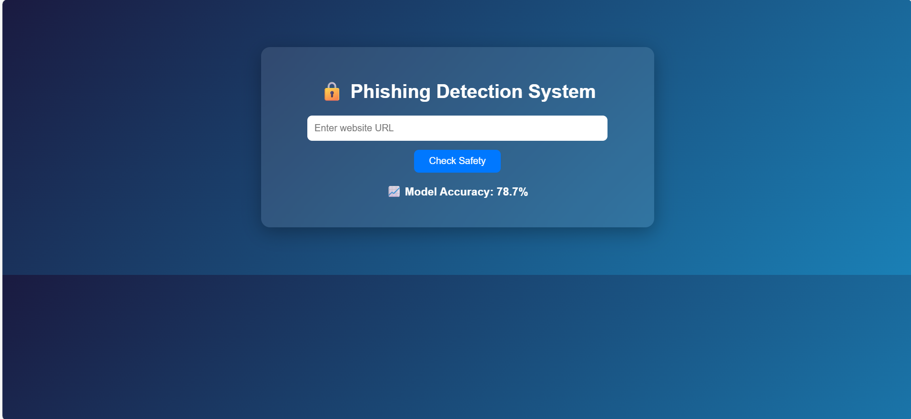
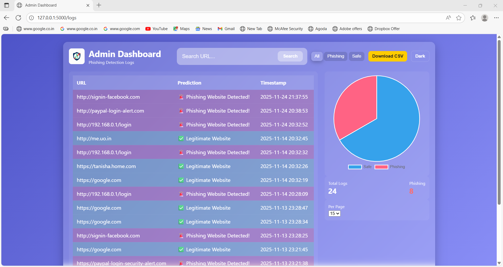
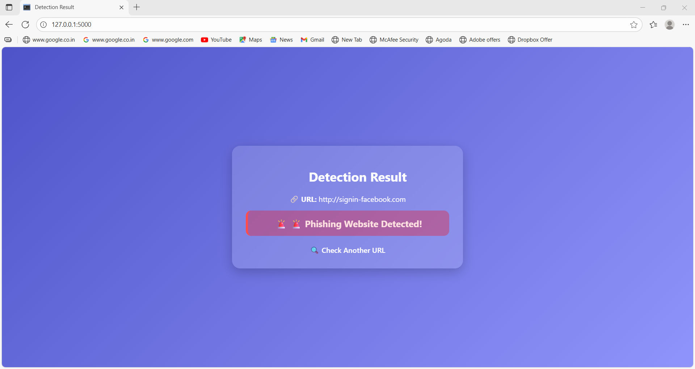

Phishing Detection System

<p align="center">
  
</p>

<h1 align="center">🛡️ Phishing Detection System</h1>

<p align="center">
A Machine-Learning powered phishing detection system with URL analysis, ML prediction, logs, dashboard, charts, dark mode & MongoDB Atlas.
</p>

<p align="center">
  
  
  
  
  
  
</p>


## 🚀 Features

### 🔍 Phishing Detection
- Predicts whether a website is **Phishing 🚨** or **Legitimate ✔**
- Uses **11 URL-based lexical features**
- Real-time ML prediction pipeline
- Clean result UI

---
## 🤖 Machine Learning

- Custom **feature extraction pipeline**
- Trained on a real phishing dataset  
- Model files included:
  - `phishing_model.pkl`
  - `accuracy.txt`  

---

## 📦 MongoDB Logging

Each prediction stores:

| Field | Description |
|-------|-------------|
| URL | The input URL |
| Prediction | Safe / Phishing |
| Timestamp | Date & time |

Stored in MongoDB Atlas.

---

## 🛠️ Admin Dashboard

A modern glass-UI dashboard with:

- 🔎 **Search bar**
- 🧪 **Filter:** All / Safe / Phishing  
- 📄 **Pagination**
- 📊 **Pie chart (Safe vs Phishing)** — Chart.js
- 📥 **Download logs as CSV**
- 🌙 **Dark/Light mode switch**
- Clean responsive UI

---

## 🖼️ Screenshots

| Home Page | Dashboard | Result Page |
|-----------|-----------|-------------|
|  |  |  |

---

## 🧰 Tech Stack
| Layer | Technologies |
|-------|--------------|
| **Frontend** | HTML, CSS, JavaScript |
| **Backend** | Flask |
| **Machine Learning** | Scikit-learn, Pandas, Joblib |
| **Database** | MongoDB Atlas |
| **Charting** | Chart.js |
| **Production Server** | Waitress |

---

## 📁 Project Structure

phishing-detection/
│
├── app/
│   ├── app.py                     # Flask main application
│   ├── config_db.py               # MongoDB connection
│   ├── feature_extraction.py      # URL feature extraction logic
│   │
│   ├── model/
│   │   ├── phishing_model.pkl     # Trained ML model
│   │   └── accuracy.txt           # Model accuracy score
│   │
│   ├── static/
│   │   ├── css/
│   │   │   └── style.css          # Global styles + dashboard UI
│   │   └── img/
│   │       └── logo.png           # Project logo
│   │
│   ├── templates/
│   │   ├── index.html             # Homepage – URL checker
│   │   ├── result.html            # Prediction result page
│   │   ├── logs.html              # Old logs page (optional)
│   │   └── dashboard.html         # Admin Dashboard (charts, filters)
│   │
│   └── Screenshots/
│       ├── Home.png               # Homepage screenshot
│       ├── Dashboard.png          # Dashboard screenshot
│       └── Result.png             # Result screenshot
│
├── dataset/
│   └── web_page_phishing_detection.csv   # Dataset for training
│
├── train_model.py                # Script to train the ML model
├── requirements.txt              # Project dependencies
└── README.md                     # Project documentation


## ⚙️ Installation & Running (Local Development)

### 1️⃣ Install Dependencies
pip install -r requirements.txt
### 2️⃣ Run Flask Server
python -m app.app

Now open:  
👉 **http://127.0.0.1:5000/**

## 🌐 Production Deployment (Waitress)

Run with production server:
waitress-serve --host=127.0.0.1 --port=5000 app.app:app

---

## 🍃 MongoDB Setup
Edit `app/config_db.py`:

```python
client = MongoClient("YOUR_MONGODB_ATLAS_URL")
Make sure your IP is whitelisted in MongoDB Atlas.


🧠 Model Training

To retrain the ML model:
python train_model.py
Outputs:
phishing_model.pkl
accuracy.txt

🔌 API Endpoints

| Endpoint         | Method | Description                |
| ---------------- | ------ | -------------------------- |
| `/`              | GET    | Home page                  |
| `/predict`       | POST   | Predict URL                |
| `/logs`          | GET    | Admin dashboard            |
| `/api/logs`      | GET    | Paginated logs             |
| `/api/stats`     | GET    | Safe vs phishing analytics |
| `/download_logs` | GET    | Export logs as CSV         |

👩‍💻 Author

Tanisha Mukharjee
🔗 GitHub: https://github.com/tanisha-mukharjee